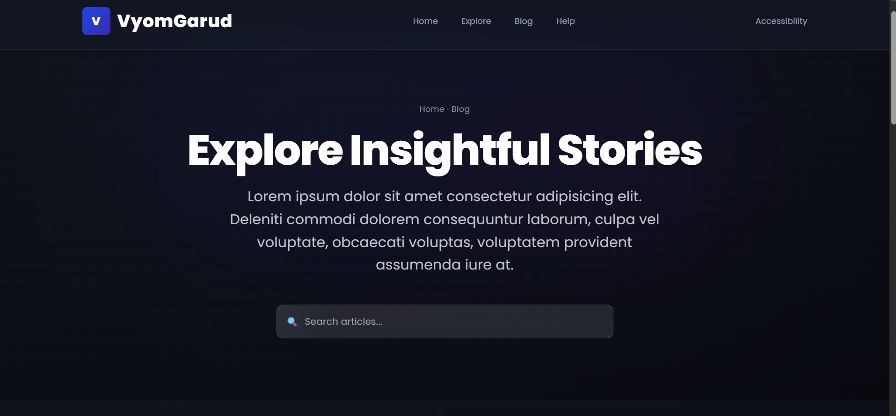
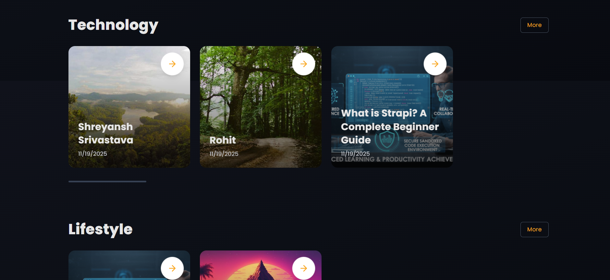
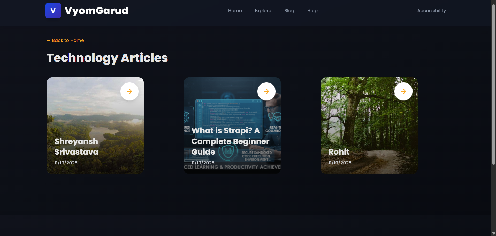
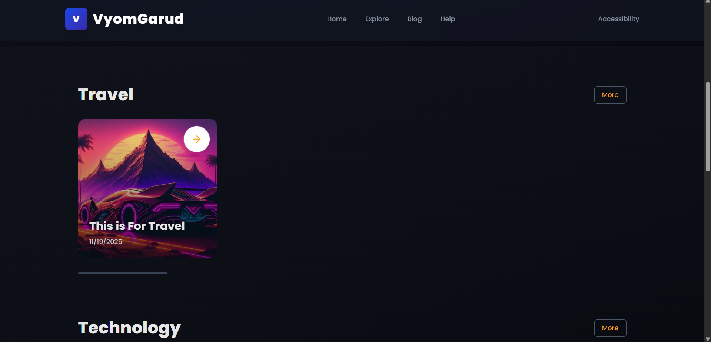
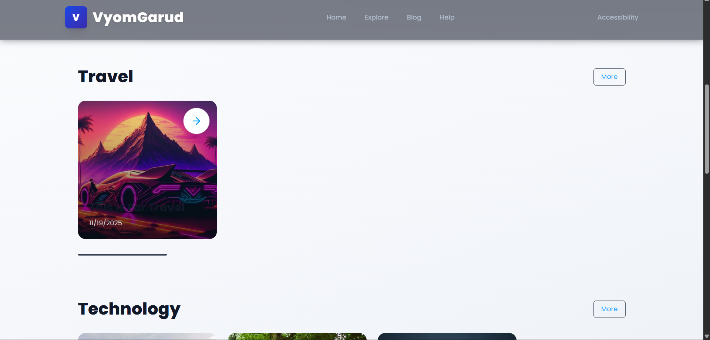

🚀 Strapi + React Blog Website

A complete full-stack blog platform built using:

Strapi v5 (Backend — REST API, Content Management)

React + Vite + TailwindCSS (Frontend — UI)

SQLite Database (Default, zero setup)

Dark / Light Theme

Scroll-Reveal Animations

Category Filtering + Search

🌟 Features
🔹 Frontend (React + Vite + TailwindCSS)

⚡ Ultra-fast Vite bundler

🎨 Modern, responsive UI

🌓 Dark / Light Mode with theme switching

🔍 Live search (title, excerpt, content)

🗂 Category-based filtering

🎞 Smooth scroll-reveal animations

🧭 Clean routing for article pages

⏳ Loading states & beautiful transitions

🔗 Connected to Strapi API

🔸 Backend (Strapi v5)

📝 Article, Category, Author content-types

🖼️ Media upload (images for articles)

🔐 Public role permissions configured

🗄️ SQLite database for easy local development

⚙️ Auto-generated Admin Panel

🌐 REST API ready for consumption

🏗 System Architecture
Users (Browser)
       ↓
React Frontend (Vite + TailwindCSS)
       ↓  Fetch API Calls
Strapi Backend (Node.js)
       ↓  CRUD Operations
SQLite Database

📁 Folder Structure
project-root/
│── backend/          # Strapi v5 Server (API + Admin Panel)
│── frontend/         # React + Vite UI
│── screenshots/      # Project screenshots
│── README.md

🛠 Setup & Run (Evaluator-Friendly)

Follow these steps to run the project locally in 20–30 minutes.

1️⃣ Clone the Repository
git clone <your-repo-url>
cd project-root

2️⃣ Setup Backend (Strapi v5)
cd backend
npm install
npm run develop

Strapi will start on:

Admin Panel: http://localhost:1337/admin

API Base: http://localhost:1337/api

On first run → create your Strapi admin user.

3️⃣ Setup Frontend (React + Vite)

Open a new terminal:

cd frontend
npm install
npm run dev

Frontend will run on:

👉 http://localhost:5173

4️⃣ Set Environment Variables (Frontend)

Create frontend/.env:

VITE_API_URL=http://localhost:1337

Restart the frontend after saving.

5️⃣ Configure Strapi Permissions (Required)

Inside Strapi Admin Panel:

Settings → Users & Permissions → Roles → Public

Enable:

Article

find

findOne

Category

find

findOne

Upload

find

findOne

Click Save.

Now your frontend can safely fetch data.

🖼 Screenshots

Screenshots provided inside the repository under:

project-root/screenshots/

You can embed them like this:

Home Page – Hero Section

Category Carousels

Article Cards

Dark Mode

Light Mode

📚 Tech Stack Summary
Layer	Technology
Frontend	React + Vite + Tailwind CSS
Backend	Strapi v5 (Node.js)
Database	SQLite
Styling	TailwindCSS
Animations	Custom Scroll Reveal + CSS Transitions
Deployment	Vercel (Frontend) / Render (Backend)
